# 3-D localization based on Magnetic field

This is my Master thesis, supervised by **Sizhen Bian**, at the group **Embedded Intelligence** of DFKI.
## Physical Background

## Devices 

| device | img | description |
| :----: | :--------: | :-----: |
| Transmitter | 
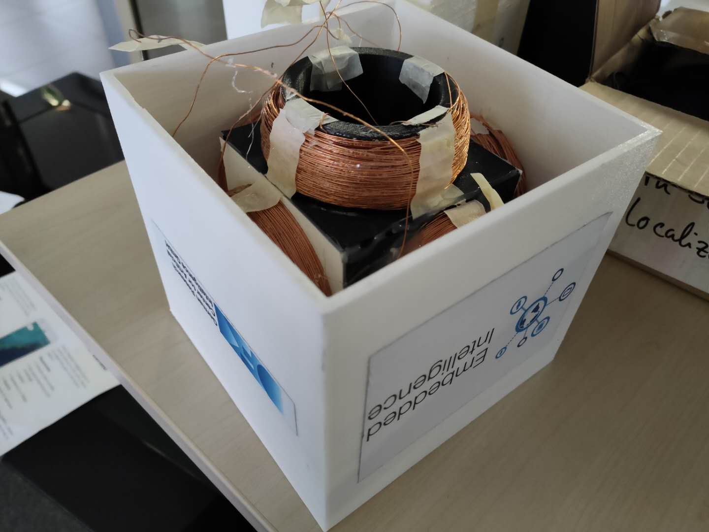
 | with 3 axes |
| Receiver (with IMU)| 
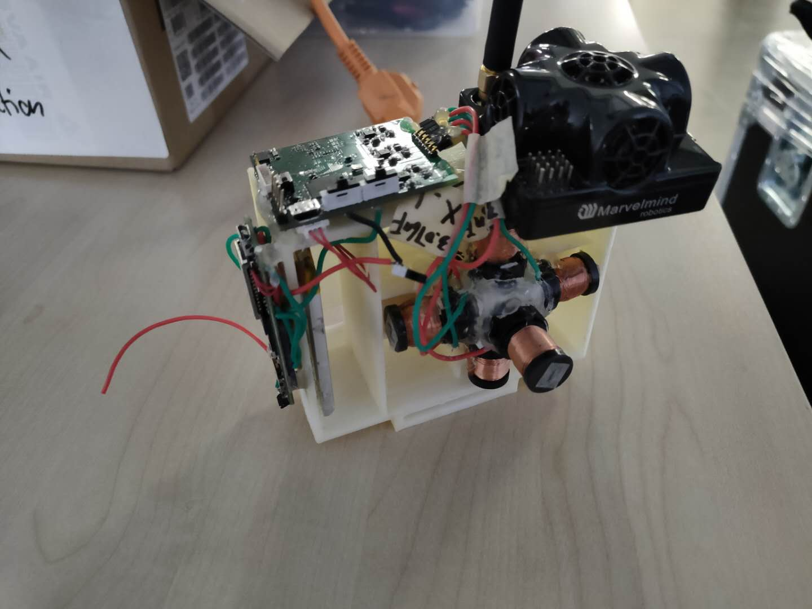
 | IMU+beacon+receiver |
| Ultra Sound| 
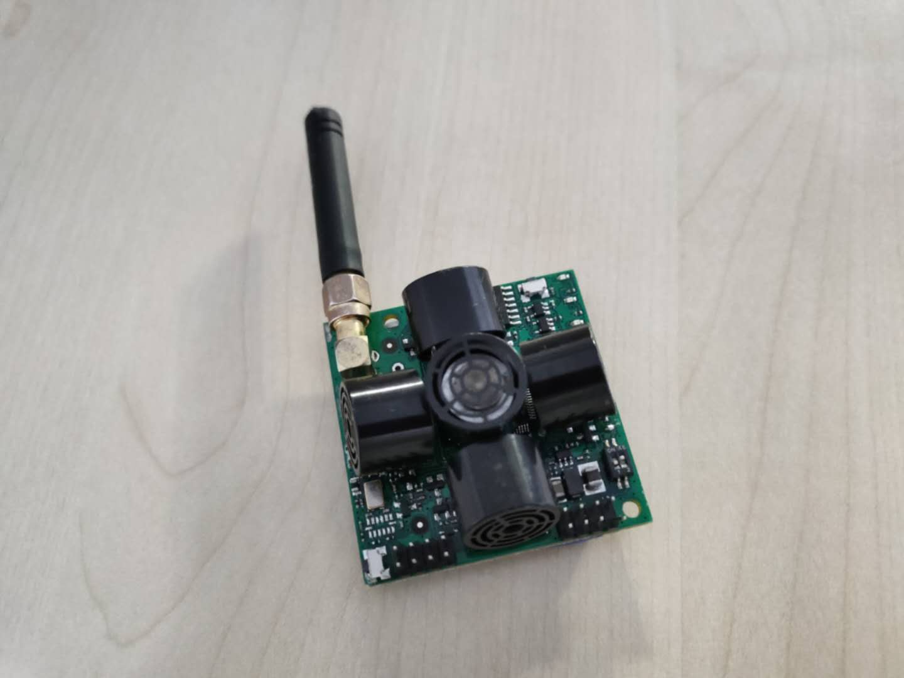
 | Mavelmind navigation system, precise 5 cm  |

## Data
We collected data both **indoor** and **outdoor**. The indoor data is at the second floor in DFKI Kaiserslautern, and outdoor data at the entrance of the DFKI. We deployed the 3 transmitters, **T1**, **T2**, and **T3** at 3 vertices of a **Equilateral triangle**, with each edge of length 3.5m, and fixed the 3 ultrasound devices. Finally, the receiver (IMU and Ultrasound embedded) is fixed at the top of a cart. By moving the cart within the Equilateral triangle area, we can collect the mag data and it's corresponding 3D coordinates simultaneously in difeerent height. 

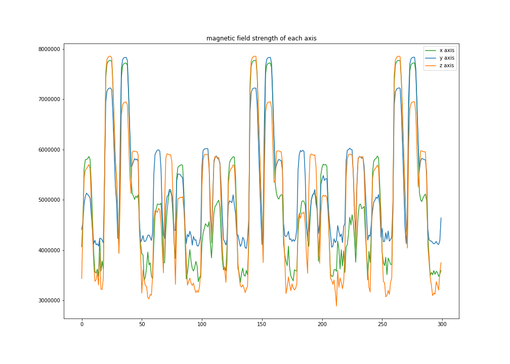
## Approach
### 1. Preprocessing
* **Detecting** each period.
* **Filtering out** the noise, picking up the peak mag point generated by each transmitter.
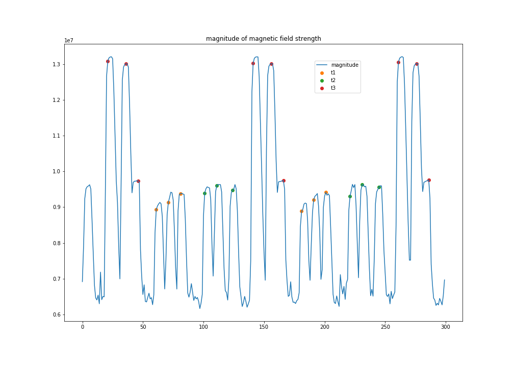
* **Interpolating** the ultrasound data, since these two sensors have different frequence, the data will be more smooth after interpolation.
* **Feature Selection** Designing the best fitted features for specific models.
* **Normalizing** the data, feeding the data to the model.

### 2. Model
Several models could be used in predicting the coordinates in 3D space, in this project, we tested both physical and machine-learning models.  
 
* Physical model

| mag_1~dis_T1 | mag_2~dis_T2 | mag_3~dis_T3|
| ---- | -------- | ----|
| 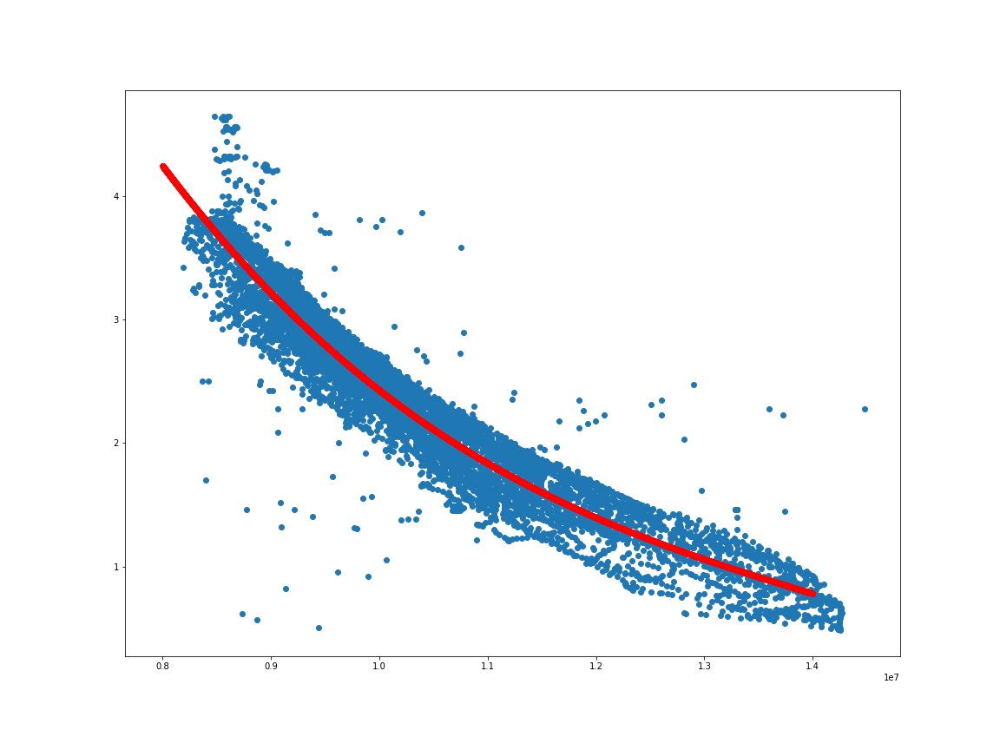| 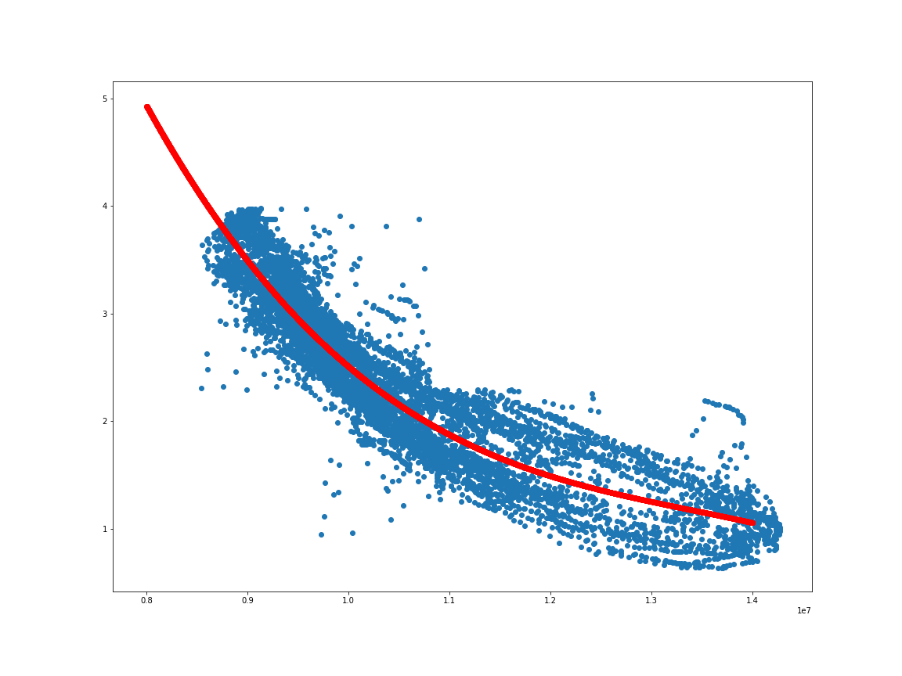 | 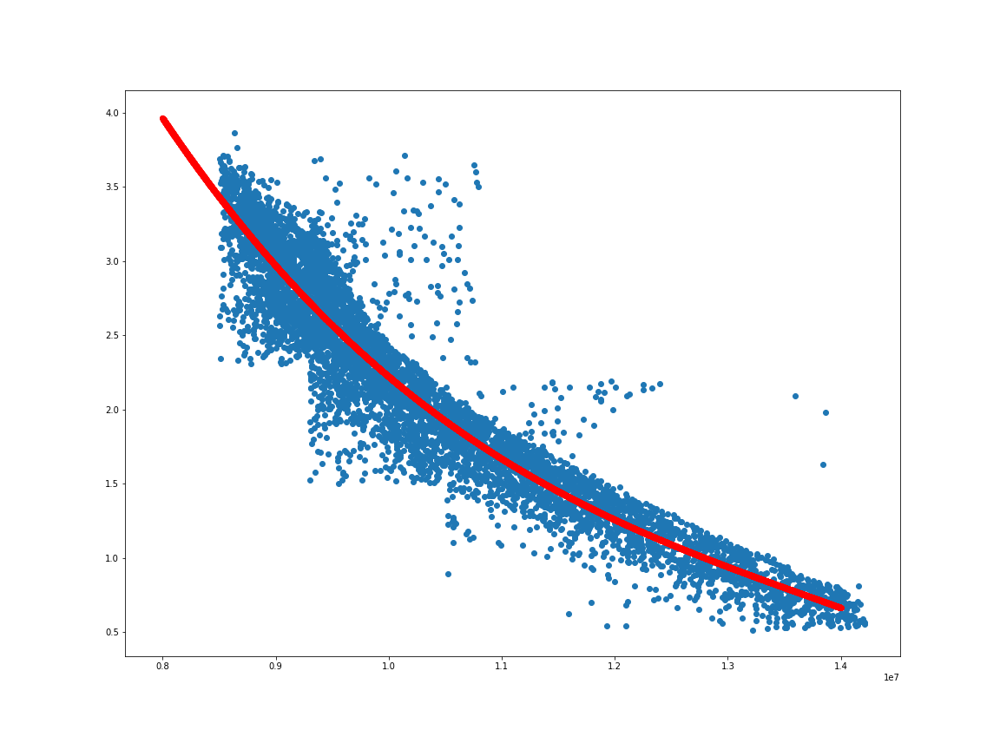|

* Machine Learning model  
  - Random Forest 
  - K-Nearest Neighboor
  - Gradient Boosting regression
  - MLP
  - AdaBoost regression
  
### 3. Outlier Detection
Due to the **robustness** problem, sometimes the returned results from machine-learning based model are shifted  away from the ground truth. Outlier detection was used to solve it. Taking a time period as a batch (1.2s, for instance), which should contain 10 predictions, and using outlier detection to filter out these inaccurate ones. The common used methods are:

- **Isolation Forest**
- One-class SVM
- Local outlier Factor
- Robust Covariance

### 4. Dead Reckoning
Dead Reckoning is a method to calculate the current position based on previously determined position. In our cases, given the **previous position** and **velocity**, we can take advantage the data from **IMU**, from which we can get **acceleration and eular angles** of each axis. 
### 4. Kalman Filter 
Kalman Filter is used to fuse the result from Dead Reckoning and the predictions from the model (physical or machine learning model). 
###  5.Data fusion
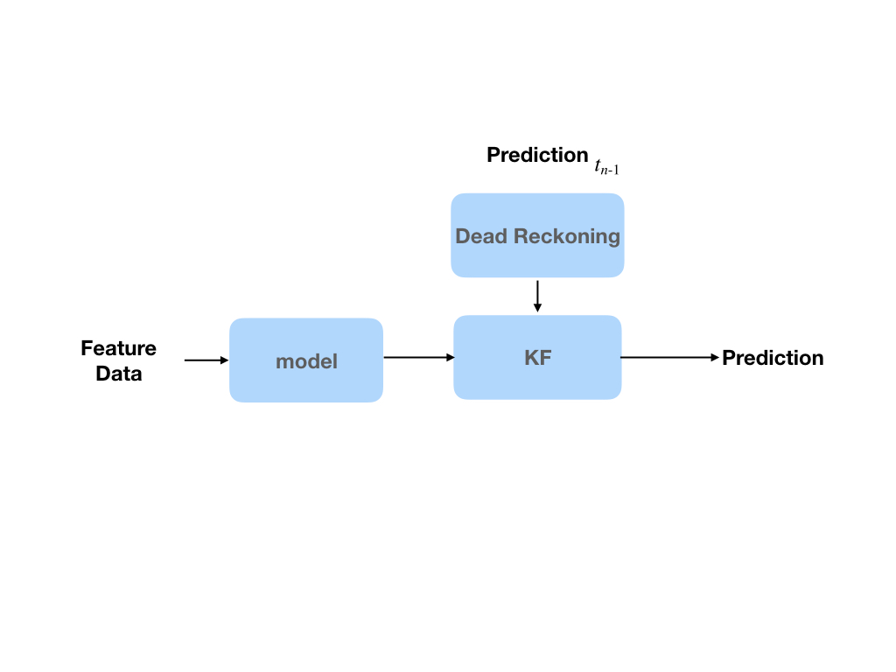

## Experiment Results
Single point prediction:

| model | accuracy (m) | std | time (s) |
|:-----:| :------: | :-----: | :----: |
| Random Forest | **0.247** | 0.228 | 0.026 |
| KNN | 0.289 | 0.298 | 0.004 |
| MLP | 0.382 | 0.313 | 0.001 |
| Gradient Boost | 0.345 | 0.303 | 0.001 |
| Ada Boost | 0.711 | 0.334 | 0.200 |
| Physical Model| 0.524 | 0.380 | 0.820 |

Sequence Prediction (200 points):

|no outlier detection | with outlier detection| sequence prediction (1s)|
| :---:| :---: | :---: |
| 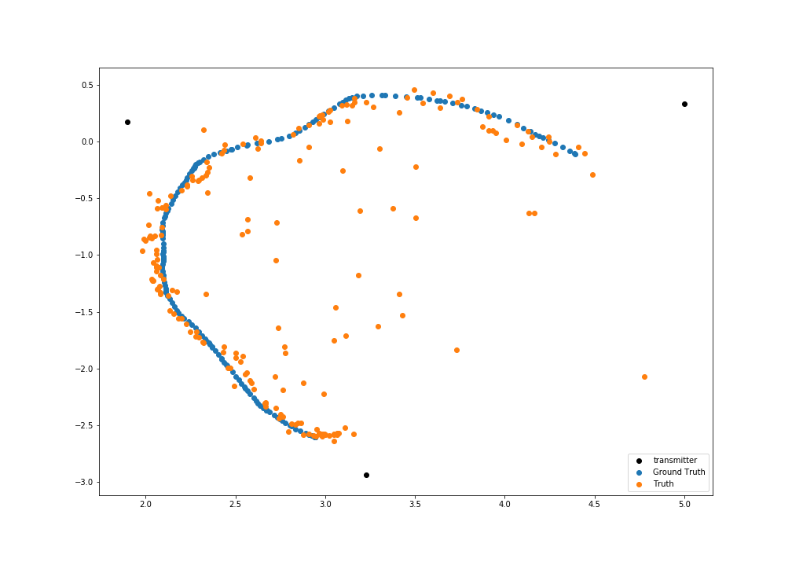|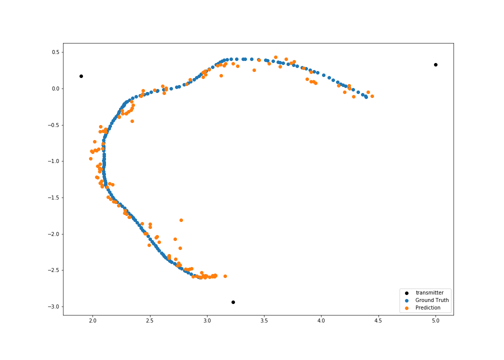|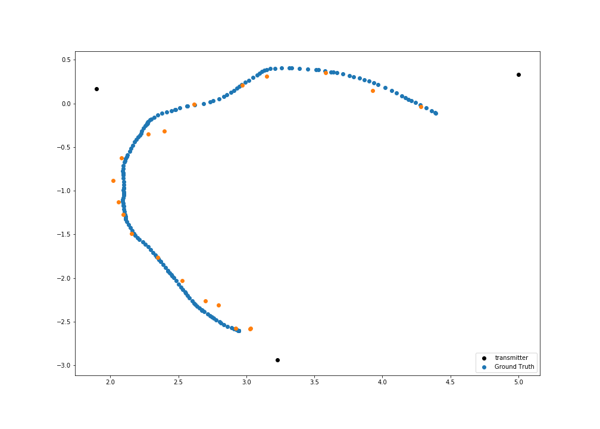|
## Code

| file | description |
| ---- | -------- |
| [phy_model.py](./phy_model.py) | a physical model, predicting the position based distances to 3 transmitters |
| [ml_model.py](./ml_model.py)| using machine learning methods to predict the position|
| [dead_reckoning.py](dead_reckoning.py) |Integrating the IMU data by using Dead reckoning algorithem|   
| Kalman_filter.py| |
| [ml_performance.ipynb](./ml_performance.ipynb) | notebook on machine learning performance codes  |
| [model](./model)| regression model and several ml models|
| [plot_thesis.ipynb](./plot_thesis.ipynb)|notebook for plotting figures|

 
## Reference

* [Integrated WiFi/PDR/Smartphone Using an Unscented Kalman Filter Algorithm for 3D Indoor Localization](https://www.ncbi.nlm.nih.gov/pmc/articles/PMC4610469/)
* [A Robust Indoor Positioning System based on Encoded Magnetic Field and Low-cost IMU](https://ieeexplore.ieee.org/abstract/document/7479703)
* [Isolation Forest](https://cs.nju.edu.cn/zhouzh/zhouzh.files/publication/icdm08b.pdf)
* [Fusion of inertial and magnetic sensors for 3D position and orientation estimation](https://ieeexplore.ieee.org/document/7591448)
